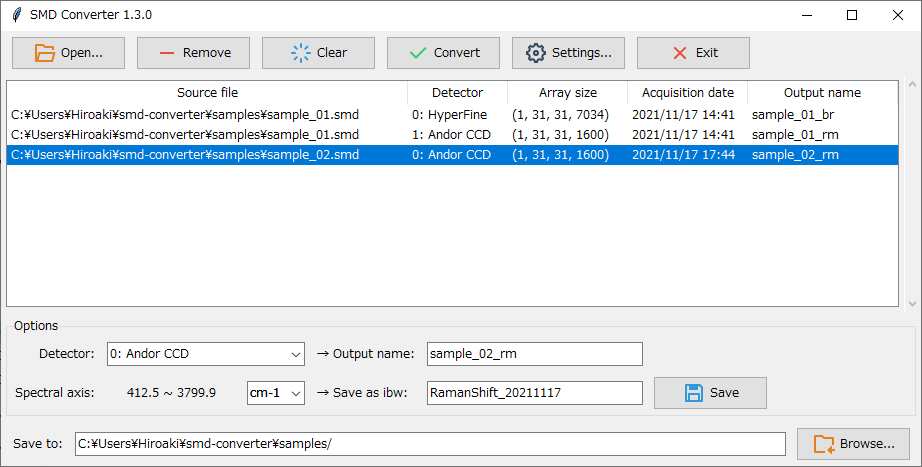

# SMD Converter
GUI application to convert smd files to [Igor Pro](https://www.wavemetrics.com/) files (Igor binary wave)



## Requirements
- [ibwpy](https://github.com/MiLL4U/ibwpy) (library to Read/Write Igor binary waves)

## Installation
### Install with pip (using Git, recommended)
1. Install [ibwpy](https://github.com/MiLL4U/ibwpy) to your Python environment
```bash
$ python -m pip install git+https://github.com/MiLL4U/ibwpy.git
```

2. Install SMD Converter
```bash
$ python -m pip install git+https://github.com/MiLL4U/smd-converter.git
```
### Use executable file (for 64bit Windows only)
1. download a compressed file (*.zip) from [Releases](https://github.com/MiLL4U/smd-converter/releases)

2. Extract SMD Converter (smdconverter.exe) from the compressed file


### Install with pip
1. Install [ibwpy](https://github.com/MiLL4U/ibwpy) to your Python environment
2. download a wheel package (*.whl) from [Releases](https://github.com/MiLL4U/smd-converter/releases)

3. Install SMD Converter with pip
```bash
$ python -m pip install smdconverter-x.y.z-py3-none-any.whl
```
(replace x.y.z with the version of SMD Converter which you downloaded)

### Install with git clone
1. Install [ibwpy](https://github.com/MiLL4U/ibwpy) to your Python environment

2. Clone this repository

```bash
$ git clone https://github.com/MiLL4U/smd-converter.git
```

3. Go into the repository

```bash
$ cd smd-converter
```

4. Install SMD Converter with setup.py

```bash
$ python setup.py install
```

## Usage
Launch GUI application with:
```bash
$ python -m smdconverter
```
or:
```bash
$ python launch.py
```
